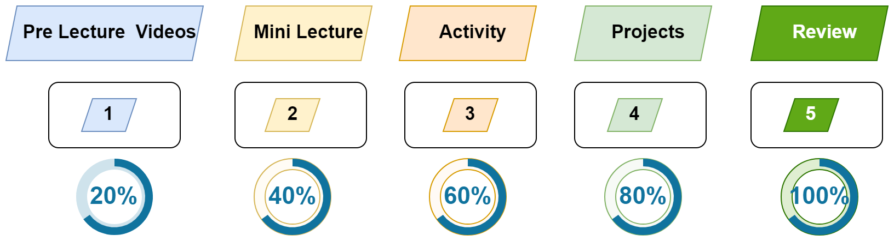

# Session 7: FullStack

> [!IMPORTANT]  
> - [Zoom Recordings](https://metropoliafi-my.sharepoint.com/:f:/g/personal/samiben_metropolia_fi/EramjTltA_BOni_R40opXRQBTQ1_gK6EWP2cbcX5G63ghA)

------

### How You'll Learn in This Course

We'll follow a 5-step learning cycle as shown in the figure below:

-----

### Session Timeline 

- Morning:
  - Mini lecture (~35min)
  - `Break` (~15min)
  - Pair programming (~35min)
  - Pair programming (~35min)
- Lunch Break - 12:00 -13:00
- Afternoon
  - Mini lecture (~35min)
  - `Break` (~15min)
  - Group Activity (~35min)
  - Mini lecture (~35min)
  - Group Activity (~35min)

-----

### Topics

- Custom hooks
- Deploying MERN STACK app on Render
- Presentations

<!-- - [Screenshots](./material/Screenshots.md) -->

-----

### Morning: Pair Programming

- Presentations: **Mini Projects**
- [Summary](./material/bepp-summary.md)
- [Level 5 (Advanced)](./material/bepp-l5.md)
- [Level 1 (Beginner)](./material/bepp-l1.md)
- cross-env: 
  - [Need for Multiple Environments](./material/bepp-summary.md#why-do-we-need-different-environments-in-an-api-server)
  - [Summary](./material/bepp-extra-summary.md), 
  - [Optional Activity](./material/bepp-extra.md), 
  - [src](./material/src/)
  - [Sample tests for users](./material/user.test.js)

-----

### Afternoon

- Presentations: **Mini Projects**
- We'll  explore **Custom Hooks**, a powerful way to encapsulate reusable logic, making our components cleaner and more modular. 
  - [Summary](./material/fe-summary-custom-hooks.md)
  - [Activity 1: Custom hooks](./material/fe-activity-custom-hooks.md)
- **Optional:** Deploying a MERN STACK app on Render
  - [Summary](./material/deployment.md)
  - [Demo Deployment](https://github.com/tx00-resources-en/week7-deploy-fe-demo)
  - [Activity 2: API testing](./material/api-testing.md) 
- Here are some recommended activities for a comprehensive review of what we’ve covered so far. 
  - [Backend](https://github.com/tx00-resources-en/w7-exam-practice-backend)
  - [Frontend](https://github.com/tx00-resources-en/w7-exam-practice-frontend)  

----

Links used in the Lecture

- [Reusing Logic with Custom Hooks](https://react.dev/learn/reusing-logic-with-custom-hooks)
- [Rules of Hooks](https://react.dev/warnings/invalid-hook-call-warning)
- [React Custom Hooks](https://www.w3schools.com/react/react_customhooks.asp)
- Add Login Authentication to React Applications
  - [Mern Auth](https://github.com/iamshaunjp/MERN-Auth-Tutorial/tree/lesson-17) 
  - [How To Add Login Authentication to React Applications](https://www.digitalocean.com/community/tutorials/how-to-add-login-authentication-to-react-applications)
  

  

<!-- links -->

<!-- 

> [!NOTE]  
> Highlights information that users should take into account, even when skimming.

> [!TIP]
> Optional information to help a user be more successful.

> [!IMPORTANT]  
> Crucial information necessary for users to succeed.

> [!WARNING]  
> Critical content demanding immediate user attention due to potential risks.

> [!CAUTION]
> Negative potential consequences of an action. 

-->